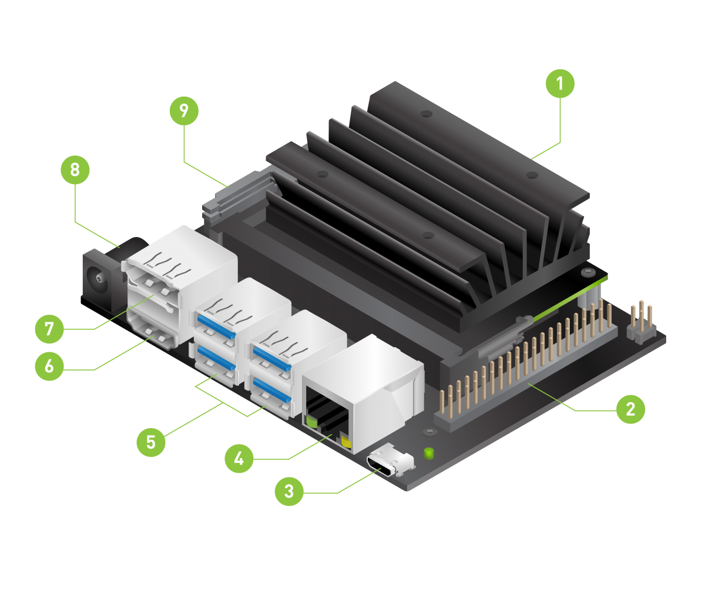
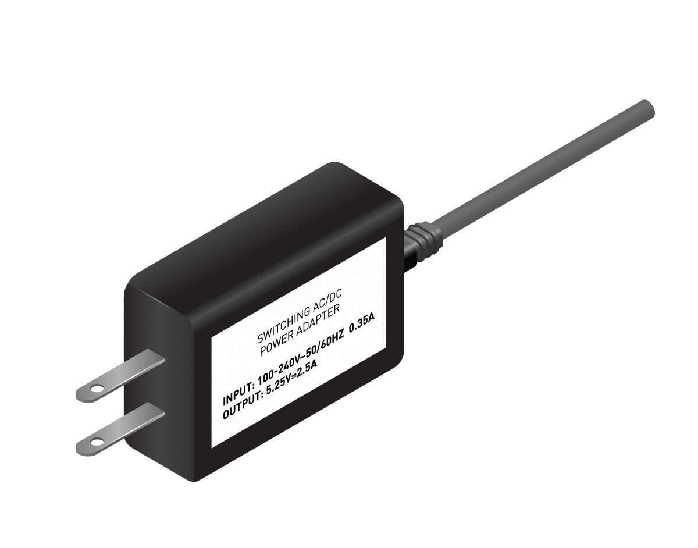
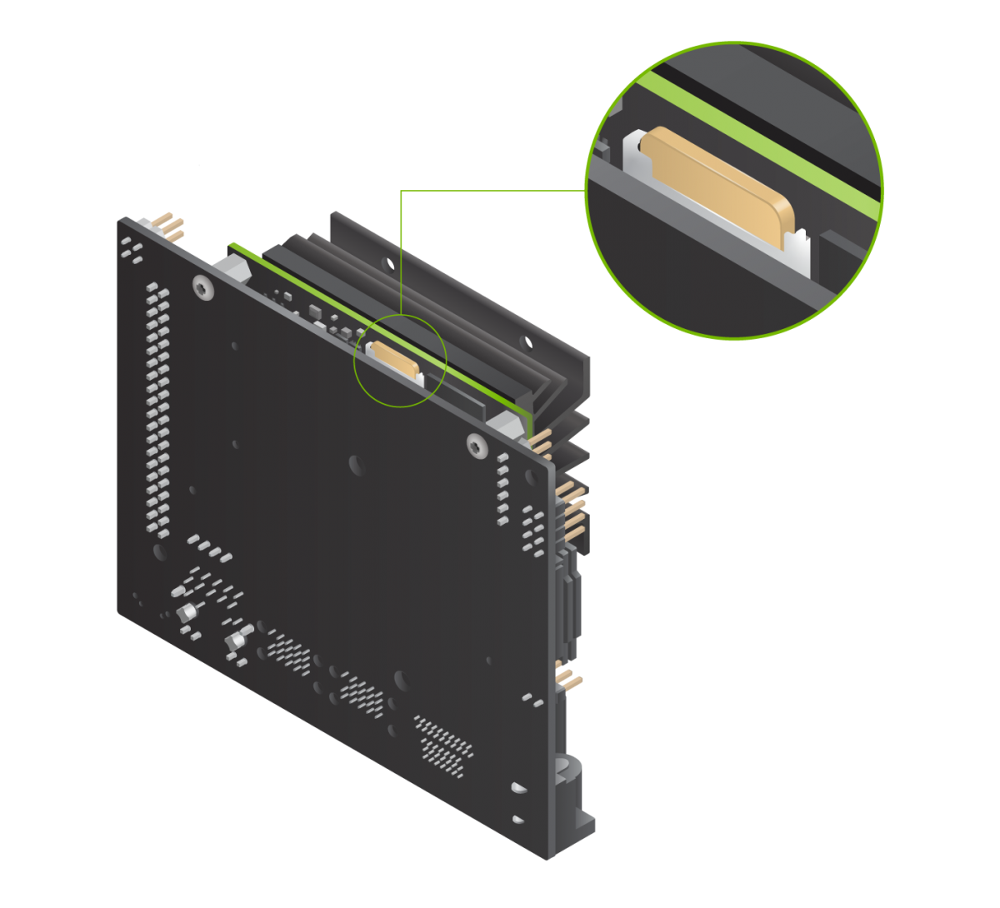
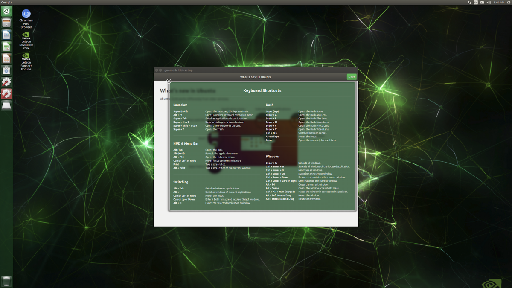

# Jetson Nano 开发者套件入门教程

目录：

- 介绍
  - 盒子包含的物品
  - 不包括的物品
- 安装准备
  - 准备开始所需物品
    - microSD 卡
    - Micro-USB 电源
  - 可选物品
- 将镜像写入 microSD 卡
  - Windows 介绍
  - Mac 介绍
  - Linux 介绍
- 安装和首次启动
  - 安装步骤
  - 首次启动
  - 在登录之后
- 下一步
  - 找到你的方式
  - 项目和学习
- 故障排除

## 介绍

### 简介

NVIDIA® Jetson Nano™ 开发者套件是一台适用于创客，学习者和开发人员的小型人工智能计算机。
按照这个简要的指导之后，你就可以开始构建实际的人工智能应用程序，很酷的人工智能机器人等等。

- 1.用于主存储的 microSD 卡插槽
- 2.40 个扩展引脚
- 3.用于 5V 电源输入或数据传输的 Micro-USB 接口
- 4.千兆以太网接口
- 5.USB 3.0 接口 (x4)
- 6.HDMI 输出接口
- 7.DisplayPort 连接器
- 8.5V 外接直流电源插孔
- 9.MIPI CSI 相机连接器

### 盒子包含的物品

你的 Jetson Nano 开发者套件盒子包含：

- Jetson Nano 开发者套件
- 写有快速开始和技术支持信息的小卡片
- 折叠纸支架

### 不包括的物品

你还需要：

- microSD 卡(最小 16GB UHS-1)
- USB 键盘和鼠标
- 电脑显示器(HDMI 或者 DP)
- Micro-USB 电源(5V⎓2A)

> 开始之前，还需要能联网并且能够烧录 microSD 卡的电脑。

## 安装准备

### 准备开始所需物品

#### microSD 卡

Jetson Nano 开发者套件使用 microSD 卡作为一个引导设备和主存储器。
一个快速的，容量足够大的卡对你的项目很重要;
最低推荐是一个 16 GB UHS-1 卡。

请参阅以下说明，使用操作系统和软件烧录 microSD 卡。

#### Micro-USB 电源

您需要使用优质电源为开发者套件供电，该电源可提供开发者套件的 Micro-USB 端口需要的 5V⎓2A 电流。
并非所有额定电压为"5V⎓2A"的电源都能做到。

作为良好电源的一个例子，NVIDIA 已经过验证[**Adafruit’s 5V 2.5A SwitchingPower Supply with 20AWG MicroUSB Cable (GEO151UB-6025)**](https://www.adafruit.com/product/1995)。
它专门用于克服 USB 电源的常见问题；有关详细信息，请参阅链接的产品页。

> **注意：**
>
> USB 电源的规定功率输出能力可以在其标签上看到。
>
> USB 电源的实际供电能力确实有所不同。
>
> 请看看 **Jetson Nano 开发者套件用户指南**了解更多信息。
>
> 
>
> 单击或点击图像查看特写。

### 可选物品

#### 无线网络适配器

Jetson Nano 开发者套件有一个千兆以太网接口，但是也支持通用 USB 无线网络适配器，例如，Edimax EW-7811Un。

## 将镜像写入 microSD

要准备 microSD 卡，您需要一台具有 Internet 连接的计算机，并且能够通过内置的 SD 卡插槽或适配器读写 SD 卡。

> 1.下载 [**JetsonNano 开发者 SD 卡镜像**](https://developer.nvidia.com/embedded/dlc/jetson-nano-dev-kit-sd-card-image), 并且清楚它保存在电脑的位置。
>
> 2.根据您使用的计算机类型，按照以下说明将图像写入 microSD 卡：Windows，Mac 或 Linux。

- WINDOWS 介绍

  > 使用 SD Association 的 SD Memory Card Formatter 格式化 microSD 卡。
  >
  > >
  >
  > - 1.下载, 安装, 并启动 [**Windows 版 SD Memory Card Formatter**](https://www.sdcard.org/downloads/formatter_4/eula_windows/).
  >
  > - 2.在 "Select card" 选择 SD 卡
  >
  > - 3.选择 "Quick format"
  >
  > - 4.让 "Volume label" 空白
  >
  > - 5.点击 “Format” 开始格式化, 并且在警告对话框选择“Yes”
  >
  > 使用 Etcher 将 Jetson Nano Developer Kit SD 卡图像写入 microSD 卡
  >
  > - 1.下载，安装和启动 [**Etcher**](https://www.balena.io/etcher)。
  >
  > >
  >
  > - 2.单击 "Select image"，然后选择之前下载的压缩图像文件。
  >
  > - 3.如果尚未插入 microSD 卡，请将其插入。如果 Windows 提示您使用如下对话框，请单击“ 取消”（根据[**此说明**](https://github.com/balena-io/etcher/issues/2024)）：
  >
  > >
  >
  > - 4.单击 "Select drive" 并选择正确的设备。
  >
  > - 5.点击 "Flash！" 如果您的 microSD 卡通过 USB3 连接，Etcher 将花费大约 10 分钟来写入并验证镜像。
  >
  > - 6.Etcher 完成后，Windows 可能会让您知道它不知道如何读取 SD 卡。只需单击取消并移除 microSD 卡。
  >
  > >
  >
  > 准备好 microSD 卡后，继续设置开发人员工具包。

- MAC 介绍
  - TODO:
- LINUX 介绍
  - TODO:

准备好 microSD 卡后，继续设置开发人者套件。

## 安装和首次启动

### 安装步骤

> 1.展开纸箱支架并放入开发者套件箱内。
>
> 2.设置纸箱支架顶层的开发者套件。
>
> 3.将 microSD 卡插入(已经写入系统镜像)位于 Jetson Nano 模块底部的槽中。
>
> 
>
> 4.打开电脑显示器电源并连接它
>
> 5.连接 USB 键盘和鼠标。
>
> 6.连接 Micro-USB 电源（5V⎓2A）。 Jetson Nano 开发者套件将自动开机并启动。

### 首次启动

开发者套件开机后，Micro-USB 连接器旁边的绿色 LED 指示灯将亮起。当您第一次启动时，Jetson Nano 开发者套件将引导您完成一些初始设置，包括：

- 阅读并接受 NVIDIA Jetson 软件 EULA
- 选择系统语言，键盘布局和时区
- 创建用户名，密码和计算机名称
- 登录

### 登录之后

你会看到这个屏幕。恭喜！

  

## 下一步

### 找到你的方式

- 阅读 [**Jetson Nano 开发者套件用户指南**](https://developer.nvidia.com/embedded/dlc/jetson-nano-dev-kit-user-guide)，它包括：
  - 关于开发者套件硬件的更多细节
  - NVIDIA JetPack 所有组件的说明，包括支持交叉编译的开发者工具。
  - 所有包含的例程和例程文档的列表。
- 前往 [**NVIDIA Jetson 开发者专区**](https://developer.nvidia.com/jetson) 访问所有 Jetson 平台信息。
- 在 [**NVIDIA Jetson 论坛**](https://devtalk.nvidia.com/default/board/372/jetson-projects/) 上提问或分享项目。

### 项目和学习

Jetson Nano 开发者套件是一款用于学习和制作的 AI 计算机。

- 查看 [**Jetson 项目页面**](https://developer.nvidia.com/embedded/community/jetson-projects) 以获取资源，包括：
  - [**Hello AI World**](https://developer.nvidia.com/embedded/twodaystoademo#hello_ai_world)
    - 开始使用预训练模型进行图像分类和对象检测的计算机视觉深度学习推理。
    - 使用 TensorRT 和直播相机进行实时加速。
    - 用 C++ 编写自己的识别程序。
    - 对于那些有兴趣训练他们自己的网络的人，请参加完整的两天演示，其中包括训练和推理。
  
  - [**JetBot**](https://github.com/NVIDIA-AI-IOT/jetbot) 是一个开源的 AI 项目，面向有兴趣学习 AI 和构建有趣应用程序的创客，学生和发烧友。
    - 它易于安装和使用，并与许多流行的配件兼容。
    - 几个交互式教程向您展示如何利用 AI 的力量教 JetBot 跟踪对象，避免碰撞等。
    - JetBot 是用于创建全新 AI 项目的出色启动板。

- 创建你自己的！
  - Jetson Nano 开发者套件提供了有用的工具，如 Jetson GPIO Python 库，兼容常见的传感器和外围设备，包括许多来自 adafruit 和 raspberry pi 的设备。
  - 支持许多流行的 AI 框架，如 TensorFlow，PyTorch，Caffe 和 MXNet，Jetson Nano 能够并行运行多个神经网络来处理数据和驱动器。

## 故障排除

### 电源

如果你无法启动你的 Jetson Nano 开发者套件，问题可能出在你的 USB 电源上。请使用一个优质电源，比如[**这个**](https://www.adafruit.com/product/1995)。

 使用优质电源线连接电源和开发套件也很重要：

- 使用永久连接电源的电源是很好的。
- 较短的电缆会更低较小的电压。

### 显示

不支持 HDMI 转 DVI 适配器。请使用接受 HDMI 或 DP 输入的显示器。
